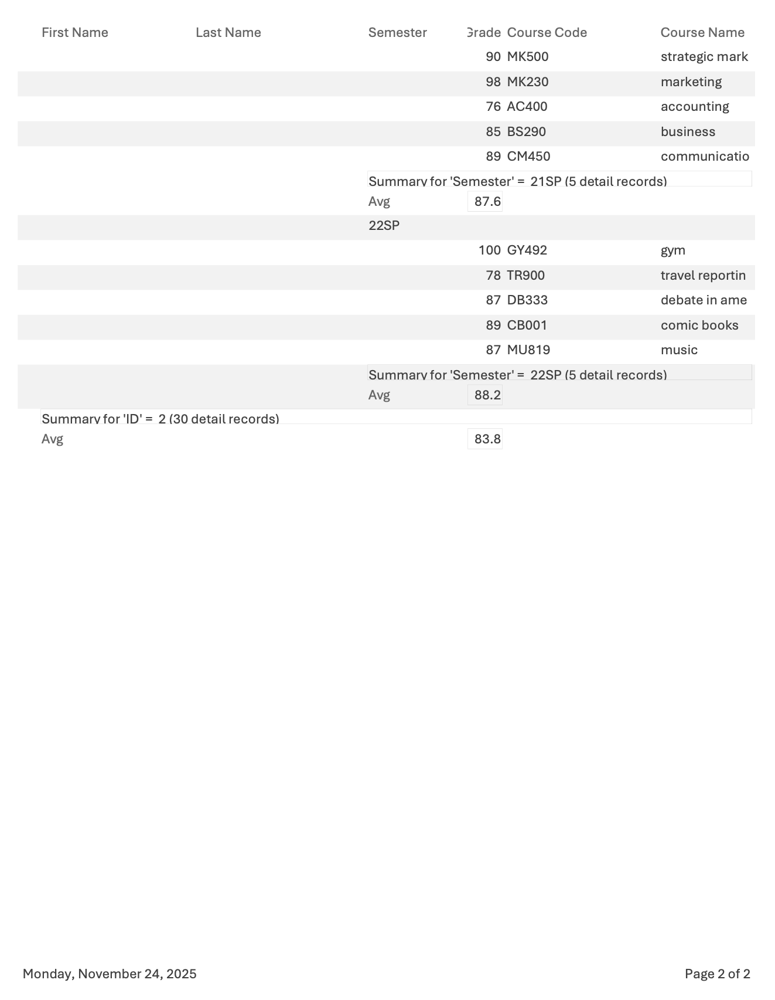
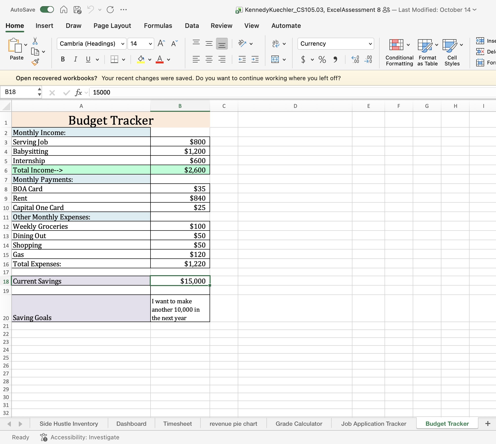
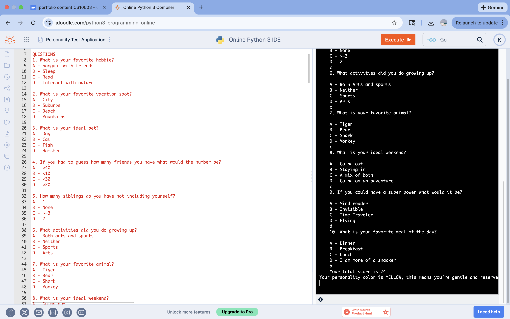

# Kennedy Kuechler
Contact Info: [267-355-4319] kgkuechler@loyola.edu , https://www.linkedin.com/in/kennedy-kuechler-3a6232293/ 
### About Me 
Hello! I am an experienced Communication Specialist and Medical Device professional with over 7 years of proven expertise in Marketing and Health Care. 

With skills in data analytics, microsoft platforms, and canva, I am able to develop data organization systems and visual presentation, and achieve overall efficiency. I am adept at using Excel, Google Platforms, and Access. 

My innovative skill set, commitment to quality,  and passion for creativity makes me a valuable asset. In my spare time, I like to hangout with friends, family and be outside. 

### Education 
BS in Biohealth, commerciliaztion conncentration / Minor - Marketing
Loyola University Maryland

***

### Projects

#### Student Transcript
 - This project was a final combination of all the things that I learned on Aporto microsoft access. I used design view, queries, relationships, and report wizards to create multiple tables and prompts that gave me results like a transcript. 

 - The reason I did this project was to insert data, create relations, and queries, and then make reports from all of that data to calculate and organize grades and data for a transcript. The problem that I set out to solve was setting up the data and formatting it.  The challenges I faced were setting up the queries so I had the right information to set up the report. My goal was to collect grades from the past year from my sister and get the GPA throughout the years. If I could go back and change anything, I would format the transcript so it was a little clearer to read.

***
#### Budget Tracker
 - For this project I decided to make a budget tracker for what I spend in a month as a senior in college. This was super beneficial to see what my income looks like and where it is being distributed. 
 
 - https://studentsloyola-my.sharepoint.com/:x:/r/personal/kgkuechler_loyola_edu/Documents/KennedyKuechler_CS105.03,%20ExcelAssessment%208.xlsx?d=wf03724156c484f7a85453e95205ce8ae&csf=1&web=1&e=7vrTdC 
 - I came up with this project by looking at my accounts and seeing where everything was being deposited or withdrawn. The problem I wanted to solve was seeing how much money I could save and make in the next year. It was a problem that needed to be solved because I want to be financially smart.The tools I used to complete this were different equations in Microsoft Excel. The challenges I faced were creating the equations, but once I understood how to select the cells and put together the right actions I understood it better. If I had to make any improvements I would have used a little more detailed equations and gone into a little more heavy details to save even more money.
***
#### Personality Test
 - Creating a personality test by coding was something that was completely out of my knowledge on how to do it. I really liked this project because I learned so much from it and it let me show my creative side.
 
 - https://www.jdoodle.com/ga/3JGGIT4RkI9oqV5XNObfrQ%3D%3D 
 - In class we were told to come up with a specific personality test. This was one of my favorite things we did in class because we could be very creative with how we coded. The problem I set out to solve was how I coded things and then depending on certain answers, that means certain numbers and then that means a color! For this project I used a coding system called JDoodle. The challenges I faced consisted of making sure everything was perfect. If one thing was off the whole output would not work. What I set out to achieve was to make a personality type based off of a color like a very outgoing exciting person would be a yellow. If I could improve this in any way, it would be to make the questions a little more detailed and less basic. 